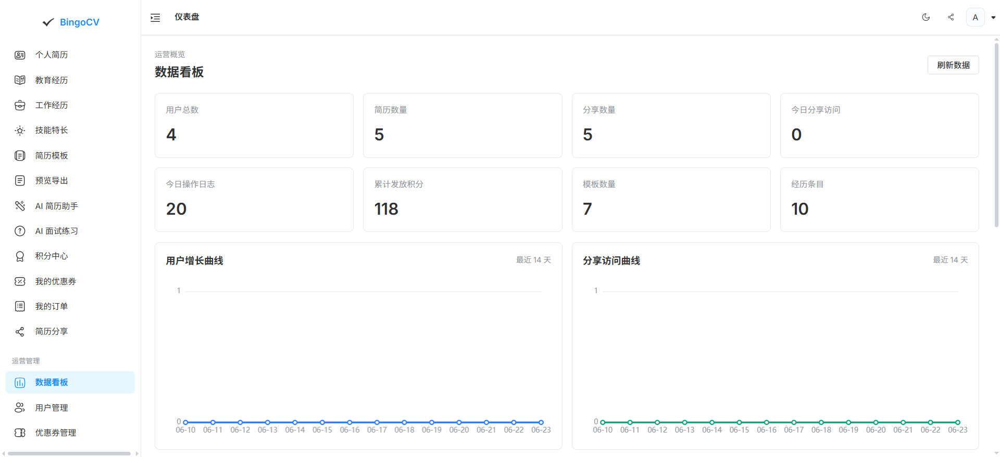
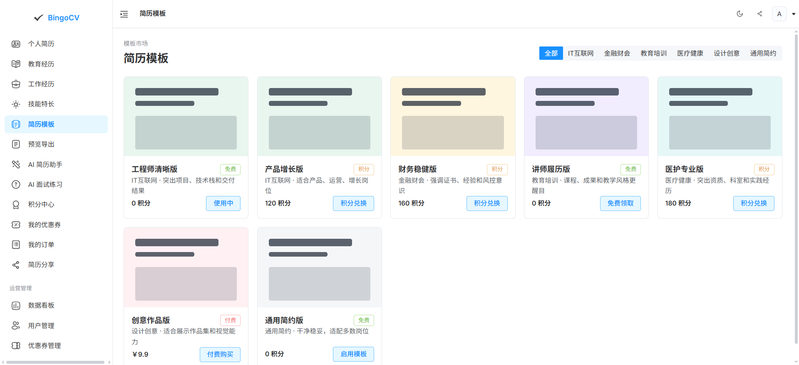
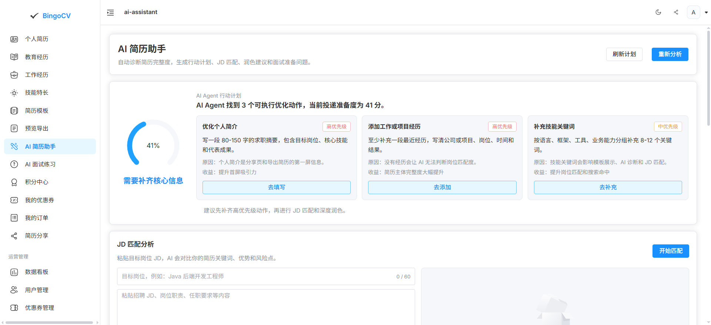
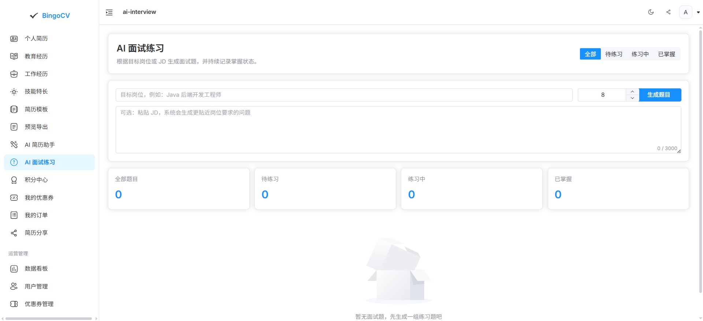
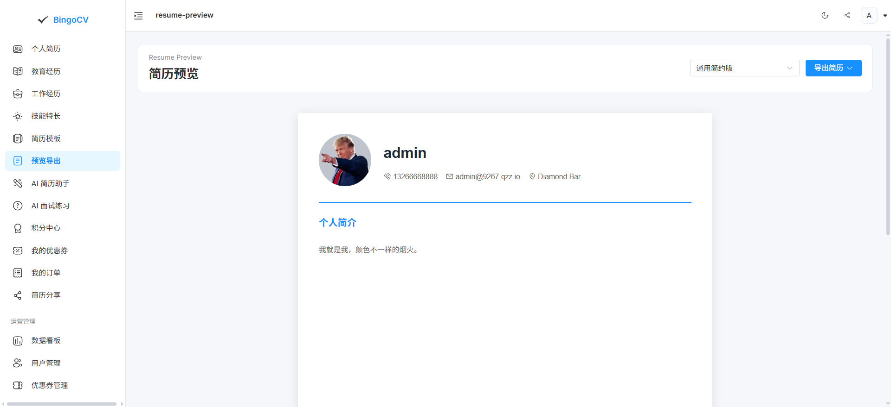

# BingoCV

<div align="center">

[](LICENSE)
[](https://www.oracle.com/java/)
[](https://spring.io/projects/spring-boot)
[](https://vuejs.org/)
[](https://www.mysql.com/)
[](https://redis.io/)

[English](README.md) | [中文](README.zh-CN.md)

BingoCV is an open-source resume management system for personal resume data, template selection, points-based template redemption, and public or private resume sharing.

The project currently includes a Spring Boot backend, a Vue 3 admin/frontend app, and MySQL initialization scripts for the core MVP.

</div>

## Features

### √ Implemented Features

#### 1. User System
- √ User registration (with invite code support)
- √ User login (captcha verification)
- √ Remember me functionality
- √ Password encryption (BCrypt)
- √ User profile management

#### 2. Resume Management
- √ **Personal Info**: Name, gender, age, city, contact (phone/email/QQ/WeChat), bio, avatar
- √ **Education**: School, major, start/end dates, description, sortable
- √ **Work Experience**: Company, position, start/end dates, job description, sortable
- √ **Skills**: Skill keywords (space-separated)
- √ **Specialties**: Specialty name, description, sortable

#### 3. Template System
- √ Template marketplace browsing (by industry)
- √ Free template usage
- √ Points redemption for templates
- √ My templates management
- √ Template activation/switching
- √ 7 preset templates (Engineer, Product, Finance, Teacher, Medical, Designer, General)

#### 4. Points System
- √ Points account management (balance, total earned, total spent)
- √ Points transaction logs
- √ Daily sign-in (increasing rewards for consecutive days)
- √ Task system (Newbie, Daily, Achievement tasks)
- √ Task completion tracking
- √ Automatic points reward distribution

#### 5. Resume Preview
- √ Real-time resume preview
- √ Responsive design
- √ Dynamic data rendering

#### 6. System Features
- √ Knife4j/OpenAPI documentation
- √ Global exception handling
- √ Unified response format
- √ Redis cache support
- √ Logical deletion
- √ Data permission control

### Planned Features

#### Phase 4: Sharing
- ⏳ Public sharing (generate share links)
- ⏳ Private sharing (access password)
- ⏳ Short URL generation
- ⏳ Access analytics (visitor IP, location, device)
- ⏳ Visitor limit
- ⏳ Share expiration

#### Phase 5: AI Enhancement
- ⏳ AI resume polishing
- ⏳ Resume scoring
- ⏳ Interview question generation
- ⏳ Smart suggestions

#### Phase 6: Advanced Features
- ⏳ RBAC permission management
- ⏳ Admin dashboard
- ⏳ Operation logs
- ⏳ API rate limiting
- ⏳ Data analytics dashboard
- ⏳ Payment orders (points recharge, template purchase)

## Tech Stack

Backend:

- Java 21
- Spring Boot 3.4.5
- MyBatis-Plus 3.5.x
- MySQL 8.x
- Redis
- Druid
- Hutool
- Kaptcha

Frontend:

- Vue 3
- Vite
- Element Plus
- Pinia
- Vue Router
- Axios
- Iconify

## Project Structure

```text
bingoCV/
|-- db/                         # Database scripts
|   `-- bingocv_schema.sql
|-- bingocv-web/                 # Vue 3 frontend
|-- bingocv-worker/              # Frontend build output directory
|   `-- dist/
|-- src/main/java/               # Spring Boot backend source
|-- src/main/resources/          # Backend configuration and resources
|-- pom.xml
|-- README.md
`-- README.zh-CN.md
```

## Quick Start

### 1. Requirements

- JDK 21+
- Maven 3.9+ or the included Maven Wrapper
- Node.js 18+
- MySQL 8.x
- Redis 6+

### 2. Initialize Database

```bash
mysql -uroot -proot < db/bingocv_schema.sql
```

The script creates the `bingoCV` database and initializes core tables for users, resumes, templates, points, tasks, sign-in, sharing, short links, system config, and payment orders.

**(Optional) Import test data:**

```bash
mysql -uroot -proot < db/bingocv_test_data.sql
```

Test data includes:
- 4 test accounts (zhangsan / lisi / wangwu / admin)
- Complete resume information (education, work, skills, etc.)
- Points accounts and transaction logs
- Task progress and sign-in records
- Unified password: `123456`

### 3. Configure Backend

Edit:

```text
src/main/resources/application.yml
```

Check that the MySQL and Redis settings match your local environment:

```yaml
spring:
  datasource:
    url: jdbc:mysql://localhost:3306/bingoCV?useUnicode=true&characterEncoding=utf-8&useSSL=false&serverTimezone=Asia/Shanghai
    username: root
    password: root
  data:
    redis:
      host: localhost
      port: 6379
```

### 4. Start Backend

```bash
./mvnw spring-boot:run
```

Windows:

```bat
mvnw.cmd spring-boot:run
```

Default backend URL:

```text
http://localhost:8080
```

### 5. Start Frontend

```bash
cd bingocv-web
npm install
npm run dev
```

The Vite dev server is usually available at:

```text
http://localhost:5173
```

### 6. Build Frontend

```bash
cd bingocv-web
npm run build
```

The release output is configured to:

```text
bingocv-worker/dist
```

## Database Script

Database scripts are located in:

```text
db/bingocv_schema.sql
```

Included tables:

- `bingo_user`
- `bingo_profiles`
- `bingo_edu`
- `bingo_work`
- `bingo_skill`
- `bingo_specialty`
- `bingo_template`
- `bingo_user_template`
- `bingo_points`
- `bingo_points_log`
- `bingo_task`
- `bingo_user_task`
- `bingo_sign_in`
- `bingo_share`
- `bingo_share_access`
- `bingo_short_url`
- `bingo_system_config`
- `bingo_pay_order`

## Roadmap

- Phase 1: Resume management and menu restructuring
- Phase 2: Template marketplace, owned templates, preview, and PDF export
- Phase 3: Points account, tasks, sign-in, and points redemption
- Phase 4: Public sharing, private sharing, short links, and access analytics
- Phase 5: AI resume polishing, resume scoring, and interview question generation
- Phase 6: RBAC, admin configuration, operation logs, API rate limiting, and dashboards

## Demo

### 1. Accounts
admin：
- username:admin
- password:123456
user:
- username:zhangsan
- password:123456

### 2. Pictures

- **Dashboard**


- **CV-Models**


- **Ai-Assistant**



- **Export**


## License
This project is released under the MIT License.